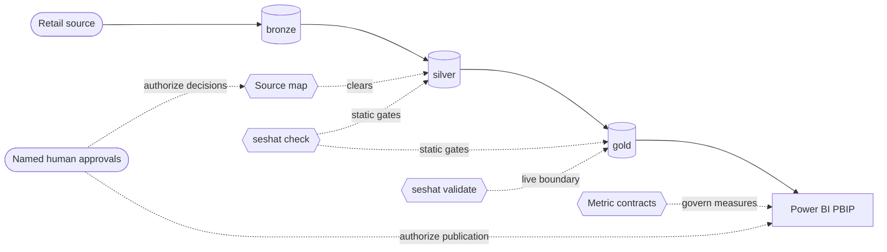

<div align="center">


# Seshat BI

### From messy retail data to trusted Power BI -- with evidence at every gate.

**The readiness system that lets AI agents build your BI pipeline, but never lets
them approve it.** Seshat profiles sources, governs mappings, validates the medallion
warehouse, binds metrics to contracts, and gates Power BI delivery. Every step is
backed by committed evidence, and every judgment call by a named human approval.

[](https://deepwiki.com/Kemetra/Seshat-BI)
[](https://pypi.org/project/seshat-bi/)
[](https://github.com/Kemetra/Seshat-BI/actions/workflows/ci.yml)
[](https://github.com/Kemetra/Seshat-BI/blob/main/pyproject.toml)
[](https://github.com/Kemetra/Seshat-BI/blob/main/LICENSE)
[](https://github.com/Kemetra/Seshat-BI/stargazers)
[](https://glama.ai/mcp/servers/Kemetra/Seshat-BI)
[](https://github.com/punkpeye/awesome-mcp-servers)
<br />
[](#how-it-works)
[](#how-it-works)
[](#agent-plugins)
[](#agent-plugins)
[](https://github.com/sponsors/Kemetra)

<br />

[**Try it in 60 seconds**](#try-it-in-60-seconds) &nbsp;&middot;&nbsp;
[**Install**](#install) &nbsp;&middot;&nbsp;
[**How it works**](#how-it-works) &nbsp;&middot;&nbsp;
[**What's new in 3.0**](#whats-new-in-30) &nbsp;&middot;&nbsp;
[**Contribute**](#contributing)

</div>

---

## Try it in 60 seconds

Run the bundled synthetic retail demo. All you need is
[uv](https://docs.astral.sh/uv/), which fetches a matching Python if you lack one.
You **do not** need a database, Power BI Desktop, or an account.

```bash
uvx --from seshat-bi seshat demo init
uvx --from seshat-bi seshat demo run
uvx --from seshat-bi seshat demo report --format html
```

Open the readiness proof it wrote to `.seshat-output/demo/index.html`:

```bash
start .seshat-output\demo\index.html      # Windows
open .seshat-output/demo/index.html       # macOS
xdg-open .seshat-output/demo/index.html   # Linux
```

Prefer a persistent install? Run `pipx install seshat-bi` once, then drop the
`uvx --from seshat-bi` prefix: `seshat demo init`, `seshat demo run`,
`seshat demo report --format html`. Leave off `--format html` to print the same report
in the terminal.

<p align="center">
  
</p>

### What you just saw

- **The committed demo fixture records three passing stages, each citing its
  evidence**: the source profile (24 rows, `order_id` unique), the cleared source
  map, and the authored silver migration.
- **Gold is blocked, on purpose.** Its gate is a live `seshat validate` run against
  a real database, and the demo never runs one, so it caps Gold at blocked. Seshat names that reason instead of
  pretending the stage passed.
- **The approvals are labelled.** The demo's approvals are marked *illustrative
  fixture, not produced by this run*. Seshat never fabricates a sign-off.
- **One next action.** The report names the single step that is allowed next.
  There is no score to game.

That honest "blocked" is the product. A tool that turns every stage green without a
database behind it is guessing.

## Why Seshat BI

A dashboard can look finished while its metrics are undefined, its source
assumptions are unsafe, and its totals have never been reconciled. AI agents make
this worse: they produce a plausible-looking model fast, then quietly decide the
grain, the PII handling, and what "revenue" means.

Seshat BI answers one question, and it never makes up the answer:

> **Is this retail source ready to become trusted Power BI?**

| A typical BI build... | With Seshat BI... |
|---|---|
| "Looks done" when the visuals render | Each stage records `status + evidence + blocking_reasons` in a version-controlled readiness file |
| The agent picks the grain and the keys | The agent surfaces the decision; a named human records it |
| Measures are written straight into DAX | Measures trace to approved metric contracts; drift is flagged |
| Totals are eyeballed in the report | Keys, date coverage, orphan relationships and reconciliation are checked against the live warehouse |
| A readiness score of "87%" | No score. Every pass cites evidence and every block names a reason |
| Publishing is a button | Publishing is the last of seven gates, and a human owns it |

Named for the ancient Egyptian figure of writing, measurement, and record keeping,
Seshat brings the same discipline to modern analytics: **map meaning, record
evidence, then build.**

## Seven gates between raw data and publication

A stage can begin only after the stage before it passes. The sequence is the product.


**Source** -> **Mapping** -> **Silver** -> **Gold** -> **Semantic Model** ->
**Dashboard** -> **Publish**

| Before Seshat allows... | The evidence must show... |
|---|---|
| Silver transformation | Mapping Ready passed and the source map is cleared. |
| Power BI over gold | Live validation passed against the real data boundary. |
| Dashboard design | Metric contracts exist and define business meaning. |
| Power BI execution | Semantic Model Ready and the publish gates passed. |

> [!IMPORTANT]
> Seshat never self-grants an approval, invents source meaning, or turns a green
> static check into a claim of live semantic correctness.

## How it works



Data flows from the retail source through `bronze`, `silver`, and `gold` into a
source-controlled Power BI PBIP project. Four kinds of gate sit along that path:

- a **source map** that must be cleared before silver,
- **`seshat check`**, which runs static gates over silver and gold,
- **`seshat validate`**, which checks gold against the live database, and
- **metric contracts**, which govern every Power BI measure.

Named human approvals authorize the mapping decisions and the publication.

The agent is the interface. You work through Claude Code, Codex, or the local Studio
console. `seshat status` tells the agent where each table stands, `seshat next` gives
it the one allowed next action, and `seshat check` / `seshat validate` are the gates
it must pass. The CLI is the engine, not the experience.

### Choose your path

| You want to... | Start here |
|---|---|
| See it work in a minute | [Run the offline demo](#try-it-in-60-seconds) |
| Start a new BI workspace | `seshat init-project my-bi` |
| Find out what to do next | `seshat status`, then `seshat next` |
| Adopt an existing PBIP project (read-only) | `seshat adopt-pbip assess --project <path>` |
| Gate a pull request | `seshat check` (text, JSON, SARIF, or the [GitHub Action](https://github.com/Kemetra/Seshat-BI/tree/main/integrations/github-action)) |
| Operate Seshat through an agent | [Agent Mode](https://github.com/Kemetra/Seshat-BI/blob/main/docs/agent-mode.md) |
| Make your first contribution | [First-contribution path](https://github.com/Kemetra/Seshat-BI/blob/main/docs/contributing/first-contribution.md) |

## What's new in 3.0

v3.0.0 is a **major** release, and the reason matters: it adds very little and
**tightens a lot**. An expert-board audit closed places where a gate could pass
on an absent, uncommitted, or unparseable input. Those gates now refuse.

- **Approvals must be committed.** Approval-bearing surfaces read `HEAD`, not the
  working tree, and a stage's approval must come from that stage's authority.
- **Stricter secret scanning.** C2 now also flags tracked `.env.local`-style files,
  filled `*_TOKEN` / `*_SECRET` keys in `.env.example`, and DSNs in UTF-16 files.
- **Safer resets and git reads.** `seshat reset` refuses to delete uncommitted work
  unless `--discard-uncommitted` is passed, and git reads refuse reflog revisions.
- **dbt and Dagster gates read committed state.** A zero-asset run no longer counts
  as success.
- **New opt-in and additive surfaces.** `seshat next --exit-code`, extra
  `seshat doctor --format json` keys, and table-scoped Studio conversations.

No rule id was added, removed, or renamed. Upgrading from 2.x? Read the
[v3.0 release note and migration table](https://github.com/Kemetra/Seshat-BI/blob/main/docs/releases/v3.0.md)
first: a repo that was green on v2.1 can turn red, and that is deliberate.

## What is built today

Seshat BI is an active beta on PyPI. The PyPI badge above shows the current release.
The shipped system includes:

- **Static and live governance gates** over SQL, TMDL/PBIR, DAX, configuration,
  documentation, keys, date coverage, orphan relationships, and reconciliation.
- **Seven-stage agent control surfaces** through `seshat status` and `seshat next`,
  grounded in committed evidence rather than a separate run-state engine.
- **Governed source mapping and metric contracts** that stop transformation or
  dashboard work while business meaning is unresolved, including governed two-table
  ratios.
- **DAX governance and generation** through static rules, contract-drift checks,
  live value proxies, and verified measure generation.
- **Governed statistical evidence.** `seshat analyze` runs a closed catalog of
  governed methods over approved metrics, then stops for named-human review without
  changing readiness.
- **Portable proof surfaces**: offline HTML, review JSON, SARIF, a GitHub Action,
  readiness passports, and an offline portfolio explorer.
- **A read-only MCP governor** (`seshat mcp`, `[mcp]` extra) that exposes
  governance state to local MCP clients over stdio and refuses execution and
  approval by construction. It is listed in
  [Awesome MCP Servers](https://github.com/punkpeye/awesome-mcp-servers) and
  scored on [Glama](https://glama.ai/mcp/servers/Kemetra/Seshat-BI).
- **Governed extension packs**, plus optional dbt and Dagster adapters that stay
  advisory and never create readiness truth.
- **Source-controlled Power BI workflows** with deterministic PBIR authoring helpers
  and a read-only assessment path for existing PBIP projects.
- **Seshat Studio**, a local analyst console (`seshat-studio`, `[studio]` extra).
  Its browser views show workspace readiness, per-table journeys, and the agent
  conversation over the same committed evidence. Operations, run history, and client
  review ship as API endpoints with no browser views yet. Studio surfaces the gates
  and never grants an approval of its own.

The [capability inventory](https://github.com/Kemetra/Seshat-BI/blob/main/docs/capabilities/capabilities.yaml),
[release history](https://github.com/Kemetra/Seshat-BI/blob/main/CHANGELOG.md), and
[roadmap](https://github.com/Kemetra/Seshat-BI/blob/main/docs/roadmap/roadmap.md)
hold the evidence behind each claim.

> [!WARNING]
> Power BI writes are gated, not free. The governed local write leg (F016 slice 5,
> `seshat pbi-mcp plan-write` / `apply`) ships and refuses to act without an
> approved, in-scope target. The remote leg remains deferred and owner-gated.
> Building the final approved page in Power BI Desktop remains a named human
> action. See [ADR 0018](https://github.com/Kemetra/Seshat-BI/blob/main/docs/decisions/0018-unpark-f016-power-bi-mcp-execution-adapter.md)
> for what was unparked and what was not.

## Install

### Python CLI

```bash
# Core CLI: static checks, readiness status, and the offline demo
pipx install seshat-bi

# ...or run any command without installing
uvx --from seshat-bi seshat --version

# Start a governed workspace
seshat init-project my-bi
```

The base install depends only on PyYAML. Everything heavier is an opt-in extra:

| Extra | Adds | Install |
|---|---|---|
| `db` | Live PostgreSQL validation (`seshat validate`, `seshat drift`) | `pipx install "seshat-bi[db]"` |
| `mssql` / `mysql` / `snowflake` | Live validation on SQL Server, MySQL, or Snowflake | `pipx install "seshat-bi[mssql]"` |
| `stats` | Governed statistical evidence (`seshat analyze`) | `pipx install "seshat-bi[stats]"` |
| `stats-change` | Change-point detection on top of `stats` | `pipx install "seshat-bi[stats,stats-change]"` |
| `dbt` | The governed dbt transformation adapter | `pipx install "seshat-bi[dbt]"` |
| `files` | Excel source profiling (CSV needs no extra) | `pipx install "seshat-bi[files]"` |
| `report` / `report-pdf` | HTML and Excel reports / PDF rendering | `pipx install "seshat-bi[report]"` |
| `mcp` | The local stdio read-only MCP governor | `pipx install "seshat-bi[mcp]"` |
| `studio` | The Seshat Studio web console (FastAPI + Uvicorn) | `pipx install "seshat-bi[studio]"` |

Already installed? Add an extra's packages in place, for example
`pipx inject seshat-bi psycopg2-binary` for `db`.

Live validation reads a DSN stored only in a gitignored `.env`. Copy
[`.env.example`](https://github.com/Kemetra/Seshat-BI/blob/main/.env.example) to
`.env` and fill in your own values. If the database driver or the `mcp`, `dbt`, or
`studio` extra is missing, Seshat prints the exact `pipx inject` / `pip install` fix
instead of an import traceback.

`seshat` is the primary command. `retail` is a deprecated alias, kept for one
deprecation cycle.

The statistical provider is read-only and initially PostgreSQL-only. Offline local
CSV evidence needs no database. See the
[architecture boundary](https://github.com/Kemetra/Seshat-BI/blob/main/docs/architecture/statistical-evidence-engine.md)
and the [synthetic workflow](https://github.com/Kemetra/Seshat-BI/blob/main/docs/worked-examples/statistical-evidence-engine.md).

### Agent plugins

**Claude Code**

```text
/plugin marketplace add Kemetra/Seshat-BI
/plugin install seshat-bi@seshat-bi-marketplace
```

**Codex**

```text
codex plugin marketplace add https://github.com/Kemetra/Seshat-BI
codex plugin add seshat-bi@seshat-bi-repository
```

Detailed setup: [user install](https://github.com/Kemetra/Seshat-BI/blob/main/docs/install/user-install.md) |
[agent install](https://github.com/Kemetra/Seshat-BI/blob/main/docs/install/agent-install.md) |
[support matrix](https://github.com/Kemetra/Seshat-BI/blob/main/docs/install/support-matrix.md)

## Who it's for

- **BI developers** who want Power BI models that trace back to governed gold tables.
- **Analytics engineers and data engineers** running a bronze -> silver -> gold
  warehouse who need gates that fail closed.
- **Analytics leaders** who need to know which numbers are safe to put in front of
  executives, and who approved them.
- **Teams building AI agents** that must stay truthful around real business data.

## Contributing

You don't need to learn the whole readiness system before making a useful first
contribution. Seshat provides bounded lanes, each with owned files, forbidden scope,
acceptance evidence, and exact verification commands.

| Starter lane | A useful contribution |
|---|---|
| KPI contract templates | Clarify reusable business definitions without inventing policy. |
| Synthetic fixtures | Add realistic, disclosure-safe test cases. |
| Dialect notes | Document compatibility behavior across supported databases. |
| Accessibility checks | Improve dashboard and documentation usability. |
| Blocker explanations | Make governance findings clearer and more actionable. |

1. Read the [first-contribution guide](https://github.com/Kemetra/Seshat-BI/blob/main/docs/contributing/first-contribution.md).
2. Pick one lane from [contribution-lanes.yaml](https://github.com/Kemetra/Seshat-BI/blob/main/docs/contributing/contribution-lanes.yaml).
3. [Claim a starter contribution](https://github.com/Kemetra/Seshat-BI/issues/new?template=starter.yml).
4. Follow the setup and pull-request checks in [CONTRIBUTING.md](https://github.com/Kemetra/Seshat-BI/blob/main/CONTRIBUTING.md).

Contributions are especially welcome in governance rules, database compatibility,
synthetic fixtures, documentation, Power BI artifacts, and agent workflows.

## Sponsor Seshat BI

Trusted BI infrastructure is public-interest work. The rules, examples, tests, and
documentation should stay inspectable by the teams that depend on them. Sponsorship
can speed up public, evidence-backed roadmap lanes such as:

- database compatibility and live-validation evidence,
- reproducible demo fixtures and cross-engine coverage,
- documentation, onboarding, accessibility, and contributor support,
- agent-safety research around analytics approvals and disclosure boundaries.

**The guardrail is simple:** funding supports the work. It never buys a readiness
approval, a rule exception, or an undisclosed product claim.

[**Sponsor Seshat BI through GitHub Sponsors**](https://github.com/sponsors/Kemetra)
&nbsp;&middot;&nbsp;
[**Discuss a public roadmap sponsorship**](https://github.com/Kemetra/Seshat-BI/issues/new?title=%5Bsponsorship%5D%20Sponsor%20a%20public%20roadmap%20lane)

For organization-level sponsorships or roadmap discussions, use the issue link only
for non-confidential context. Do not post procurement, client, or payment information
in a public issue.

## Repository guide

<details>
<summary><b>Where the system lives</b></summary>

| Path | Responsibility |
|---|---|
| `AGENTS.md` | Short operating contract and hard stops for agents. |
| `.specify/` | Constitution and feature specifications. |
| `src/seshat/` | CLI, governance rules, validation, and agent-facing surfaces. |
| `mappings/` | Per-table profiles, source maps, decisions, metrics, and readiness. |
| `warehouse/` | Tool-agnostic bronze, silver, and gold SQL artifacts. |
| `powerbi/` | Source-controlled PBIP semantic models and reports. |
| `templates/` | Generic readiness, mapping, metric, dashboard, and handoff blanks. |
| `skills/` | Canonical BI reasoning and workflow knowledge. |
| `docs/` | Architecture, readiness, operations, guides, and worked examples. |
| `tests/` | Unit, integration, contract, and optional live-database evidence. |

</details>

### Essential documentation

| Topic | Guide |
|---|---|
| Readiness model | [The seven-stage spine](https://github.com/Kemetra/Seshat-BI/blob/main/docs/readiness/readiness-model.md) |
| Architecture | [Readiness pipeline](https://github.com/Kemetra/Seshat-BI/blob/main/docs/architecture/readiness-pipeline.md) |
| Agent operation | [Agent Mode](https://github.com/Kemetra/Seshat-BI/blob/main/docs/agent-mode.md) |
| Existing PBIP adoption | [Read-only adoption workflow](https://github.com/Kemetra/Seshat-BI/blob/main/docs/tools/pbip-adoption.md) |
| Demo internals | [Demo harness](https://github.com/Kemetra/Seshat-BI/blob/main/docs/demo/demo-harness.md) |
| Governance vocabulary | [Glossary and rule catalog](https://github.com/Kemetra/Seshat-BI/blob/main/docs/glossary.md) |
| Frequently asked questions | [FAQ](https://github.com/Kemetra/Seshat-BI/blob/main/docs/faq.md) |
| Product direction | [Roadmap](https://github.com/Kemetra/Seshat-BI/blob/main/docs/roadmap/roadmap.md) |
| Release history | [Changelog](https://github.com/Kemetra/Seshat-BI/blob/main/CHANGELOG.md) |
| Brand system | [Visual identity](https://github.com/Kemetra/Seshat-BI/blob/main/docs/brand/visual-identity.md) |

## Deliberate boundaries

Seshat BI is a governed Retail BI factory. It is not a one-click dashboard generator,
a Fabric deployment platform, a universal ERP connector, or an automated approval
engine. New automation is valuable only when it strengthens one readiness stage
without taking a decision away from its accountable human owner.

## License

Seshat BI is available under the [Apache License 2.0](https://github.com/Kemetra/Seshat-BI/blob/main/LICENSE).

<div align="center">

<br />

**Governed knowledge. Measured structure. Trusted BI.**

If Seshat BI stopped a bad number before it reached a meeting, or you think it
should, [**star the repo**](https://github.com/Kemetra/Seshat-BI/stargazers). ⭐ It
is the simplest way to help other analytics teams find it.

<sub>Seshat BI -- built in public for analytics people who would rather stop a bad number than decorate it.</sub>

</div>
