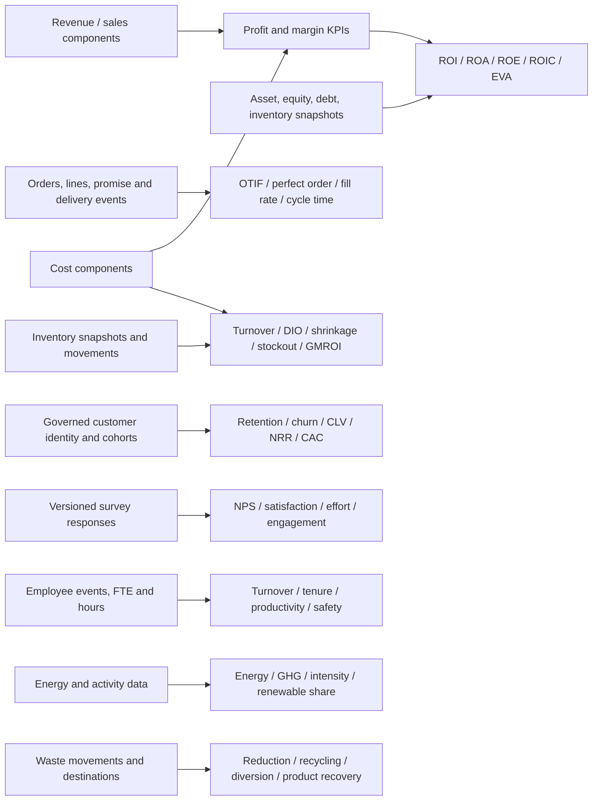

# Enterprise KPI Knowledge Layer

> A governed, implementation-neutral KPI reference for Seshat BI agents.
>
> Source base: Bernard Marr, *Key Performance Indicators: The 75 Measures Every
> Manager Needs to Know*, expanded and modernized with current standards and
> authoritative guidance.
>
> Distribution note: this file contains original, paraphrased governance guidance.
> The private research copy of the source book is not part of the Seshat BI
> repository or public agent bundles.

## 1. Purpose and status

This knowledge layer helps an agent reason about the **business meaning** of a KPI
before SQL, DAX, Python, a semantic model, or a dashboard is built. It is designed
to complement:

- `skills/retail-kpi-knowledge/`
- `skills/retail-kpi-knowledge/registry.yaml`
- `templates/metric-contract.yaml`
- `templates/kpi-pack.yaml`

It is a **candidate reference**, not an approved registry extension. Its KPI IDs
do not replace Seshat's `KPI-MC-*` identities. A candidate becomes a Seshat KPI
only after the extension checklist, source evidence, policy decisions, metric
contract, and named-owner review exist.

This layer:

- defines business questions, formula intent, grain, additivity, dependencies,
  interpretations, and common traps;
- identifies obsolete, ambiguous, composite, and policy-sensitive measures;
- distinguishes business KPIs from data-quality controls;
- supports an answerability verdict and an implementation handoff.

This layer does **not**:

- write DAX, SQL, Python, PBIP, or dashboard specifications;
- assert that a source field or gold column exists;
- invent a target, benchmark, weighting, scope, or exclusion;
- approve a policy or grant any Seshat readiness stage;
- turn a benchmark or survey score into a confidence score.

## 2. The governed KPI workflow

Use this sequence for every KPI:

1. **Start with a decision question.** State what a named owner needs to know and
   what decision could change.
2. **Select a candidate concept.** Use the catalog below as a reference, not as a
   mandatory scorecard.
3. **Classify answerability.** Use exactly one of `answerable`,
   `blocked_by_source`, `blocked_by_policy`, or `not_applicable`.
4. **Resolve meaning.** Agree scope, inclusions, exclusions, grain, event date,
   currency/unit, restatements, and comparison population.
5. **Declare mathematical behavior.** Record numerator, denominator, additivity,
   time behavior, and zero/blank handling.
6. **Bind only to governed data.** A Seshat project contract binds logical meaning
   to confirmed `gold` fields; this reference never guesses a physical field.
7. **Define evidence.** Name reconciliation, reasonableness, boundary, and sample
   checks before implementation.
8. **Obtain owner approval.** Only a named human owner can approve definition,
   target, thresholds, and action-on-breach.
9. **Hand off.** SQL owns transformations and physical binding; DAX owns filter
   context and measures; dashboard design owns presentation; Readiness owns gates.

## 3. KPI, metric, measure, target, and control

| Term | Governed meaning |
|---|---|
| KPI | A performance indicator tied to a business objective, decision, owner, target or expected direction, and action. |
| Metric | A quantified business concept. It may become a KPI in one context and remain diagnostic in another. |
| Measure | The implemented semantic-model calculation. It is downstream of this layer. |
| Target | An owner-approved value or band for a defined population and period. It is not copied from a generic benchmark. |
| Benchmark | A contextual comparator whose population, period, methodology, and source must be disclosed. |
| Data-quality control | Evidence about the trustworthiness of data or a metric. It is not automatically a business KPI. |

The book's 75 measures are a strong discovery catalog. They are not a universal
dashboard. Strategy and decision questions determine the final KPI set.

## 4. Minimum contract for a decision-ready KPI

Every project KPI should resolve these fields. A blank number-moving field is a
blocker, not an invitation for the agent to guess.

| Contract field | Required content |
|---|---|
| Stable identity | Short unique name, aliases, domain, and optional generic KPI reference. |
| Business question | The decision question the KPI helps answer. |
| Definition | Plain-language meaning, including what qualifies and what does not. |
| Formula intent | Numerator, denominator, transformations, and unit in business language; no code. |
| Owner | Named accountable person or business role with authority to decide policy. |
| Grain | Base event/snapshot/cohort grain and valid reporting grains. |
| Additivity | Fully additive, semi-additive, or non-additive, including explicit time behavior. |
| Time semantics | Event date, posting date, snapshot date, fiscal calendar, window, comparison period, and restatement rule. |
| Population | Eligible entities, cohort entry/exit, internal/test exclusions, and late-arriving records. |
| Required concepts | Logical source concepts, each marked confirmed, assumed, derived, or missing. |
| Dimensions | Valid slices and prohibited slices where interpretation breaks. |
| Currency/unit | Currency, conversion date/rate, quantity unit, and normalization basis. |
| Direction and target | Higher/lower/target-band plus owner-set target and warning/critical bands. |
| Action on breach | Named operational response, escalation owner, and review cadence. |
| Validation | Reconciliation source, bounds, component tie-outs, samples, and expected exceptions. |
| Provenance | Source document, owner decision IDs, source/map evidence, version, and effective date. |
| Privacy | PII sensitivity, minimum cohort size, suppression, and publication constraints. |
| Lifecycle | Candidate, seeded, planned, deprecated, or retired; plus Seshat readiness status and blockers where applicable. |

## 5. Grain and additivity doctrine

### 5.1 Grain

Common grains include transaction line, transaction header, customer-event,
customer-cohort, order line, order, case, employee-period, project-control period,
asset-shift, product-location-day, inventory snapshot, and accounting period.

Never divide components taken from incompatible grains. Never count line rows when
the business question asks about receipts, orders, customers, cases, or employees.

### 5.2 Additivity

- **Fully additive (A):** may be summed across all valid dimensions and time,
  such as clean revenue, cost, units, emissions, or hours.
- **Semi-additive (S):** may be summed across some dimensions but requires a
  declared rule over time, such as ending inventory, headcount, capacity, or
  a cumulative YTD value.
- **Non-additive (N):** must be recomputed from base components in every filter
  context. All ratios, rates, percentages, averages, indices, and ranks are
  non-additive.

For a rate, the valid total is normally `sum of numerators / sum of denominators`,
not the average or sum of child rates. Store the components whenever possible.

### 5.3 Formula notation

`t` means the current governed period; `t-1` means the approved comparison period.
`Avg` means a time-weighted or opening/closing average only when the owner has
approved the averaging policy. `Eligible` means the contract-defined population.
All denominator-zero behavior must be explicit: blank, not applicable, or zero.

## 6. Book-derived KPI catalog

The following catalog preserves the book's six perspectives while modernizing
terminology and governance. `KPI-REF-*` is a local reference namespace only.

### 6.1 Financial perspective

| ID | KPI and business formula intent | Shape and governance notes |
|---|---|---|
| KPI-REF-001 | **Net profit.** Revenue minus all recognized costs, expenses, interest, and tax for the governed accounting scope. | Flow, A, accounting period. Reconcile to the approved income statement; accounting policy, consolidation scope, and exceptional items matter. |
| KPI-REF-002 | **Net profit margin.** Net profit divided by revenue. | Ratio, N. Recompute from components; never sum business-unit margins. Revenue and profit must use the same scope, period, and currency. |
| KPI-REF-003 | **Gross profit margin.** Gross profit divided by revenue, where gross profit is revenue minus the approved cost of sales. | Ratio, N. Cost classification and returns/discount/VAT treatment are policy decisions. Use weighted totals, not average child margins. |
| KPI-REF-004 | **Operating profit margin.** Operating profit divided by revenue. | Ratio, N. The operating/non-operating boundary must follow the approved reporting framework and be stable across periods. |
| KPI-REF-005 | **EBITDA.** Earnings before interest, tax, depreciation, and amortization, with every adjustment disclosed. | Flow, A only as a governed subtotal. It is not cash flow. For externally communicated adjusted EBITDA, reconcile to a defined financial-statement subtotal. |
| KPI-REF-006 | **Revenue growth rate.** `(Revenue_t - Revenue_t-1) / Revenue_t-1`. | Time transform, N. Owner decides comparable period, constant currency, acquisitions/disposals, restatements, and like-for-like population. |
| KPI-REF-007 | **Total shareholder return.** `(Ending share value - beginning share value + distributions) / beginning share value`. | Return, N, security-period. Define reinvestment, corporate actions, measurement dates, and peer/index comparison. |
| KPI-REF-008 | **Economic value added.** Net operating profit after tax minus invested capital multiplied by the approved cost of capital. | Derived amount, A only after policy. Requires NOPAT, invested capital, WACC, and accounting adjustments; do not infer WACC. |
| KPI-REF-009 | **Return on investment.** Net governed benefit divided by investment cost. | Ratio, N. “Benefit,” “investment,” attribution window, terminal value, and counterfactual must be contractually defined. |
| KPI-REF-010 | **Return on capital employed.** Operating profit divided by average capital employed. | Ratio, N. Define operating profit, average method, and capital employed, commonly total assets minus current liabilities. |
| KPI-REF-011 | **Return on assets.** Net income divided by average total assets. | Ratio, N. Use average assets for a flow-over-stock ratio and disclose lease, goodwill, and revaluation policy. |
| KPI-REF-012 | **Return on equity.** Net income attributable to the relevant owners divided by average equity attributable to them. | Ratio, N. Numerator and denominator ownership scopes must match; negative equity requires special interpretation. |
| KPI-REF-013 | **Debt-to-equity ratio.** Governed debt divided by governed equity. | Ratio, N, point-in-time. Decide gross/net debt, lease liabilities, book/market equity, minority interest, and snapshot date. |
| KPI-REF-014 | **Cash conversion cycle.** Days inventory outstanding plus days sales outstanding minus days payables outstanding. | Derived duration, N. Component policies, averages, credit sales, inventory cost basis, and negative cycles require disclosure. |
| KPI-REF-015 | **Working capital ratio (current ratio).** Current assets divided by current liabilities. | Ratio, N, balance-sheet snapshot. Liquidity quality matters; stale inventory and restricted cash can make the ratio misleading. |
| KPI-REF-016 | **Operating expense ratio.** Operating expenses divided by the approved revenue or operating-income denominator. | Ratio, N. The label is ambiguous across sectors; contract the denominator and expense classification explicitly. |
| KPI-REF-017 | **CAPEX-to-sales ratio.** Capital expenditure divided by revenue. | Ratio, N. Define cash CAPEX versus additions, leases, acquisitions, and maintenance versus growth CAPEX. |
| KPI-REF-018 | **Price/earnings ratio.** Market price per share divided by earnings per share for the same basis. | Market multiple, N, snapshot/period hybrid. Define trailing/forward EPS, diluted/basic shares, currency, loss handling, and price timestamp. |

### 6.2 Customer perspective

| ID | KPI and business formula intent | Shape and governance notes |
|---|---|---|
| KPI-REF-019 | **Net Promoter Score.** Percentage of promoters minus percentage of detractors using the approved 0-10 recommendation question; passives remain in the respondent denominator. | Survey index, N. Preserve question wording, channel, sampling, response rate, eligibility, and confidence interval. NPS is not a causal explanation. |
| KPI-REF-020 | **Customer retention rate.** `(Eligible customers at end - new customers acquired in period) / eligible customers at start`. | Cohort ratio, N. Identity resolution, cohort entry, reactivation, account hierarchy, period, and customer-vs-contract unit are policy decisions. |
| KPI-REF-021 | **Customer satisfaction index.** Governed aggregation of responses to defined satisfaction items. | Survey index, N. Question wording, scale, weights, top-box versus mean, sample coverage, and nonresponse treatment must be versioned. |
| KPI-REF-022 | **Customer profitability.** Customer or segment revenue minus attributable product, service, acquisition, and cost-to-serve amounts. | Derived amount, usually A at customer-period before rollup. Shared-cost allocation and future-value treatment require owner policy. |
| KPI-REF-023 | **Customer lifetime value.** Discounted expected contribution margin over the approved customer horizon, less acquisition and service costs as defined. | Modelled value, N. Record model version, cohort, churn/retention assumptions, discount rate, uncertainty, privacy, and realized-vs-predicted status. |
| KPI-REF-024 | **Customer turnover/churn rate.** Customers lost in the period divided by eligible customers at the beginning or at-risk population. | Cohort ratio, N. Do not assume it equals one minus retention unless populations and windows are identical. Define voluntary, involuntary, logo, revenue, and product churn. |
| KPI-REF-025 | **Customer engagement.** A defined behavioral rate or approved composite reflecting meaningful product/service interactions. | Event rate or index, N. Avoid opaque “engagement scores”; publish components, weights, eligibility, bot/test exclusions, and time window. |
| KPI-REF-026 | **Customer complaints.** Valid complaints, preferably shown as count, rate per eligible transactions/customers, severity, substantiation, and resolution status. | Count A; rate N. Deduplicate cases and separate contact volume from complaints. Channel coverage and complaint taxonomy affect trends. |

### 6.3 Marketing and sales perspective

| ID | KPI and business formula intent | Shape and governance notes |
|---|---|---|
| KPI-REF-027 | **Market growth rate.** `(Total governed market size_t - market size_t-1) / market size_t-1`. | Time transform, N. Market boundary, currency, volume/value basis, source methodology, revisions, and period must be fixed. |
| KPI-REF-028 | **Relative market share.** Organization market share divided by the largest competitor's or approved reference competitor's share. | Ratio, N. The market, competitor set, geographic boundary, and external-data freshness are policy. |
| KPI-REF-029 | **Brand equity.** Owner-approved financial, behavioral, or survey-based construct that captures incremental brand value. | Model or composite, N. Do not mix awareness, preference, price premium, and valuation without disclosed lineage, weights, and method version. |
| KPI-REF-030 | **Cost per lead.** Eligible campaign/marketing cost divided by valid leads generated. | Ratio, N. Define cost allocation, lead qualification, attribution window/model, duplicates, bots, and organic versus paid scope. |
| KPI-REF-031 | **Conversion rate.** Eligible conversions divided by eligible opportunities at the same funnel stage. | Ratio, N. Name the exact numerator event, denominator population, window, attribution, deduplication, and late conversion rule. |
| KPI-REF-032 | **Search ranking and click-through rate.** Rank is the observed position for a governed keyword/device/location; CTR is clicks divided by impressions. | Rank and ratio, both N. Never average rank without an approved weighting method. Separate paid and organic, brand and non-brand, and search-engine definitions. |
| KPI-REF-033 | **Page views and bounce rate.** Page views are valid view events; the bounce definition is analytics-platform specific. | Count A; rate N. Treat the book's bounce concept as legacy. In GA4, bounce rate is the percentage of sessions that were not engaged and is the inverse of engagement rate under GA4's rules. |
| KPI-REF-034 | **Customer online engagement level.** Prefer explicit rates such as engaged sessions, active-user retention, or meaningful event completion rather than a hidden composite. | Event/cohort ratio, N. Version analytics instrumentation, consent scope, bot filtering, identity stitching, and “meaningful” events. |
| KPI-REF-035 | **Online share of voice.** Qualified mentions or impressions for the brand divided by the governed category total. | Ratio, N. Define channels, query taxonomy, sentiment/quality filters, geography, language, spam, and inaccessible private content. |
| KPI-REF-036 | **Social networking footprint.** Report platform-specific qualified reach, active audience, or followers rather than one cross-platform sum. | Snapshot S or event rate N. Cross-platform people overlap, fake accounts, algorithm changes, and API coverage make raw totals non-comparable. |
| KPI-REF-037 | **Klout score.** Retired third-party influence score. | **Deprecated/retired.** Klout closed in 2018. Preserve only for historical lineage; replace with decision-linked reach, engagement, share-of-voice, assisted conversion, or brand-lift measures. |

### 6.4 Operational processes and supply chain perspective

| ID | KPI and business formula intent | Shape and governance notes |
|---|---|---|
| KPI-REF-038 | **Six Sigma level.** A governed transformation of defect opportunity yield or defects per million opportunities into a sigma level. | Quality transform, N. Define unit, defect, opportunity, inspection coverage, short/long-term convention, and any process-shift assumption. |
| KPI-REF-039 | **Capacity utilization rate.** Actual conforming output or used capacity divided by approved practical/theoretical capacity for the same resource and window. | Ratio, N. Capacity basis, product mix, planned downtime, bottleneck, and unit equivalence are policy. |
| KPI-REF-040 | **Process waste level.** Non-value or discarded input measured by mass, units, time, or cost, preferably divided by eligible input/output. | Amount A; rate N. Define waste categories, normal loss, coproducts, rework, measurement boundary, and valuation. |
| KPI-REF-041 | **Order fulfillment cycle time.** Elapsed business or calendar time from approved start event to approved fulfillment/delivery event. | Duration distribution, N. Publish median and percentiles where skewed; define pauses, partial orders, cancellations, and timezone. |
| KPI-REF-042 | **Delivery in full, on time (DIFOT/OTIF).** Eligible orders delivered both in full and on or before the promised threshold divided by eligible delivered orders. | Ratio, N. The promise source, line/order grain, tolerance, partials, customer changes, cancellations, and proof-of-delivery rules are owner decisions. |
| KPI-REF-043 | **Inventory shrinkage rate.** `(Book inventory - verified physical inventory) / book inventory`, by quantity or value. | Ratio, N, snapshot/reconciliation. Define valuation, negative stock, count adjustments, timing, damage, theft, and known administrative loss. |
| KPI-REF-044 | **Project schedule variance.** Earned value minus planned value at the control date. | EVM amount, A within one governed baseline. It is a budget-value variance, not elapsed time; baseline changes and work-breakdown rollups require control. |
| KPI-REF-045 | **Project cost variance.** Earned value minus actual cost at the control date. | EVM amount, A within one governed baseline/currency. Align cost accruals, progress recognition, control date, and work-breakdown grain. |
| KPI-REF-046 | **Earned value.** Budgeted value of work actually performed at the control date. | Derived amount, A under the baseline. Requires approved scope, work-breakdown structure, budget, progress method, and status date. |
| KPI-REF-047 | **Innovation pipeline strength.** Transparent portfolio of qualified ideas/opportunities by stage, expected value, evidence, capacity, and risk. | Portfolio/composite, N. Avoid a single opaque score. Stage probabilities and weights are owner judgments, not agent confidence. |
| KPI-REF-048 | **Return on innovation investment.** Attributable realized or forecast net benefit from governed innovations divided by innovation investment. | Ratio, N. Define counterfactual, attribution, horizon, failures, cannibalization, risk, discounting, and realized versus modelled value. |
| KPI-REF-049 | **Time to market.** Elapsed time from the approved concept/funding/start event to approved market-availability event. | Duration distribution, N. Segment by product type; define pauses, rework, regulatory waits, phased launches, and aborted initiatives. |
| KPI-REF-050 | **First-pass yield.** Conforming units completed without rework divided by units entering the process. | Ratio, N. Define unit, process boundary, rework, scrap, repeat attempts, sampling, and inspection escapes. |
| KPI-REF-051 | **Rework level.** Reworked units, hours, or cost divided by eligible production or service output. | Amount A; rate N. Separate detected rework from escaped defects and avoid mixing unit, labor, and cost rates under one label. |
| KPI-REF-052 | **Quality index.** Owner-approved composite of explicit quality components. | Composite, N. Publish components, weights, normalization, missing-data behavior, direction, and version; prefer a diagnostic set when weights lack a defensible policy. |
| KPI-REF-053 | **Overall equipment effectiveness.** Availability multiplied by performance multiplied by quality for scheduled production. | Product of ratios, N. Define planned production time, ideal cycle, good count, product mix, micro-stops, and changeovers. Never average child OEE values without component weighting. |
| KPI-REF-054 | **Process or machine downtime.** Unavailable time, often shown as duration and as unavailable time divided by scheduled time. | Duration A; rate N. Separate planned/unplanned, event count, mean time to repair, overlapping events, and bottleneck impact. |
| KPI-REF-055 | **First contact resolution.** Eligible cases resolved during the first qualified contact without repeat contact in the approved confirmation window divided by eligible cases. | Ratio, N. Define case identity, contact, transfer, reopen, self-service, repeat window, and customer confirmation. |

### 6.5 Employee perspective

| ID | KPI and business formula intent | Shape and governance notes |
|---|---|---|
| KPI-REF-056 | **Human capital value added.** Revenue minus non-workforce operating costs, divided by or compared with workforce cost/FTE according to the approved variant. | Derived amount or ratio. The label has multiple formulas; contract the exact variant and workforce/non-workforce cost boundary. |
| KPI-REF-057 | **Revenue per employee.** Revenue divided by average FTE or average headcount. | Ratio, N. Choose FTE versus heads, employee/contractor scope, average method, currency, acquisitions, and shared-service allocation. |
| KPI-REF-058 | **Employee satisfaction index.** Governed aggregation of defined satisfaction survey items. | Survey index, N. Protect anonymity; disclose scale, weighting, eligible population, response rate, timing, and minimum cohort suppression. |
| KPI-REF-059 | **Employee engagement level.** Validated survey or behavioral construct tied to commitment, enablement, and intent to stay. | Survey/composite, N. Do not conflate activity with engagement. Preserve instrument version, factors, weights, response bias, and privacy. |
| KPI-REF-060 | **Staff advocacy score (eNPS variant).** Percentage of employee promoters minus employee detractors under a defined recommendation question. | Survey index, N. Keep distinct from customer NPS; disclose wording, anonymity, population, response rate, and survey cadence. |
| KPI-REF-061 | **Employee churn/turnover rate.** Eligible separations divided by average eligible headcount for the period. | Ratio, N. Separate voluntary, involuntary, regrettable, retirement, internal mobility, and contingent workers. |
| KPI-REF-062 | **Average employee tenure.** Sum of service duration for the eligible workforce divided by eligible headcount at the snapshot date. | Snapshot average, N/S. Disclose continuous-service rules, mergers, leave, rehiring, cohort, and survival bias. |
| KPI-REF-063 | **Bradford factor.** Commonly `S squared multiplied by D`, where S is absence spells and D is absence days in the window. | Individual risk flag, N. It is policy- and jurisdiction-sensitive, can penalize disability/caring patterns, and must not automate employment decisions; require HR/legal review. |
| KPI-REF-064 | **360-degree feedback score.** Governed aggregation of competency ratings by approved rater groups. | Survey index, N. Keep self/manager/peer/direct-report groups visible; define scale, weights, confidentiality, calibration, and minimum rater counts. |
| KPI-REF-065 | **Salary competitiveness ratio.** Internal base or total compensation divided by the approved external market reference. | Ratio, N. Match role, level, geography, date, currency, hours, pay element, and percentile; disclose stale or modeled survey data. |
| KPI-REF-066 | **Time to hire.** Elapsed time from approved requisition/opening event to accepted offer, with time to fill/start tracked separately if needed. | Duration distribution, N. Define start/end events, paused days, evergreen roles, internal candidates, withdrawals, and percentile reporting. |
| KPI-REF-067 | **Training return on investment.** `(Monetized attributable benefit - total training cost) / total training cost`. | Ratio/model, N. Separate learning, behavior, and business outcomes; define counterfactual, attribution window, opportunity cost, and uncertainty. |

### 6.6 Corporate social responsibility perspective

| ID | KPI and business formula intent | Shape and governance notes |
|---|---|---|
| KPI-REF-068 | **Carbon footprint.** Greenhouse-gas emissions in tCO2e, reported by Scope 1, Scope 2, and relevant Scope 3 categories before any governed total or intensity. | Amount A; intensity N. Define organizational/operational boundary, gases, factors, market/location Scope 2, biogenic emissions, base year, estimates, and offsets separately. |
| KPI-REF-069 | **Water footprint.** Water withdrawal, consumption, and discharge by source, quality, location, and water-stress context. | Volume A; intensity N. Avoid one context-free total; define basin, source, metering/estimation, returned water, quality, and scarcity weighting. |
| KPI-REF-070 | **Energy consumption.** Energy consumed by source and type, converted to a governed common unit, with intensity shown separately. | Amount A; intensity N. Define boundary, electricity/fuel/steam, conversion factors, renewable certificates, losses, and production denominator. |
| KPI-REF-071 | **Savings from conservation/improvement.** Baseline-adjusted avoided resource cost or use, net of program costs where the business question requires financial savings. | Derived amount, A after policy. Freeze baseline, weather/volume normalization, price, persistence, rebound, attribution, and verification method. |
| KPI-REF-072 | **Supply chain miles.** Prefer distance, tonne-kilometres, load factor, and associated emissions by mode rather than raw miles alone. | Amount A; intensity N. Define shipment leg, mode, actual/estimated route, weight/volume, empty running, outsourced transport, and geographic boundary. |
| KPI-REF-073 | **Waste reduction rate.** `(Baseline waste - current comparable waste) / baseline waste`. | Time transform, N. Define waste categories, mass/value basis, normalized activity, acquisitions, hazardous waste, and baseline recalculation. |
| KPI-REF-074 | **Waste recycling rate.** Waste sent to verified recycling divided by total waste generated. | Ratio, N. Define generated waste, recycling, contamination, recovery hierarchy, downstream verification, and exclusions; do not label incineration recycling without policy. |
| KPI-REF-075 | **Product recycling rate.** Eligible products or material mass recovered/recycled divided by the approved sold, returned, or end-of-life population. | Cohort ratio, N. Denominator lag, take-back coverage, material yield, geography, third-party evidence, and reuse/remanufacture/recycling distinctions matter. |

## 7. Modern extension catalog

These candidates extend gaps in the older book. They remain reference candidates
until registered and approved in a Seshat project.

| ID | KPI and business formula intent | Shape and governance notes |
|---|---|---|
| KPI-REF-076 | **Operating cash flow.** Net cash generated or used by operating activities under the governed reporting framework. | Flow, A. Reconcile to the cash-flow statement; cash classification and working-capital movements matter. |
| KPI-REF-077 | **Free cash flow.** Operating cash flow minus the approved capital-expenditure amount. | Flow, A. There is no universal variant; disclose maintenance/growth CAPEX, leases, acquisitions, and nonrecurring items. |
| KPI-REF-078 | **Cash conversion ratio.** Operating cash flow divided by net income or another explicitly named earnings denominator. | Ratio, N. The label is ambiguous; contract the denominator, period alignment, exceptional items, and negative-value behavior. |
| KPI-REF-079 | **Return on invested capital.** Net operating profit after tax divided by average invested capital. | Ratio, N. Define NOPAT, capital, averages, goodwill, leases, excess cash, and accounting adjustments. |
| KPI-REF-080 | **Net revenue retention.** Ending recurring revenue from the opening customer cohort, including expansion and contraction and excluding new-logo revenue, divided by opening recurring revenue. | Cohort ratio, N. Define recurring revenue, cohort, FX, products, reactivations, acquisitions, and contract changes. |
| KPI-REF-081 | **Customer acquisition cost.** Eligible acquisition sales-and-marketing cost divided by newly acquired customers. | Ratio, N. Match attribution window, cost pool, customer identity, organic/paid allocation, sales cycle, and new-vs-reactivated policy. |
| KPI-REF-082 | **LTV-to-CAC ratio.** Governed customer lifetime value divided by governed customer acquisition cost for matching cohorts. | Model ratio, N. Never divide company-wide metrics from different populations; expose model uncertainty and payback period alongside it. |
| KPI-REF-083 | **Return on ad spend.** Attributed revenue or contribution margin divided by advertising spend, with the numerator named in the KPI title. | Ratio, N. Revenue ROAS is not profit; define attribution, incrementality, window, refunds, fees, tax, and cross-channel overlap. |
| KPI-REF-084 | **Funnel stage conversion.** Entities entering the next governed stage divided by eligible entities entering the prior stage within the approved window. | Cohort ratio, N. Stage events, deduplication, recycling, skipped stages, identity, and maturation lag must be stable. |
| KPI-REF-085 | **Customer effort score.** Governed aggregation of answers to a fixed effort question after a defined journey or interaction. | Survey index, N. Preserve wording, scale direction, trigger, channel, sampling, and response rate; do not merge with satisfaction without a model. |
| KPI-REF-086 | **GA4 engagement rate.** Engaged sessions divided by sessions, using GA4's current engaged-session rule. | Platform-defined ratio, N. Version the platform definition and event configuration; instrumentation changes can move the metric without behavior changing. |
| KPI-REF-087 | **Perfect order rate.** Orders meeting all approved completeness, timeliness, damage-free, and documentation/error-free conditions divided by eligible orders. | Ratio, N. Conditions are conjunctive; calculate from order-level flags, not by multiplying separately aggregated rates. |
| KPI-REF-088 | **Forecast accuracy using WAPE.** `1 - sum absolute forecast error / sum absolute actual`, or report WAPE directly as error. | Ratio, N. Title must say accuracy or error; define horizon, forecast vintage, zero actuals, cancellations, hierarchy, and value/units weighting. |
| KPI-REF-089 | **Inventory turnover.** Cost of goods sold divided by average inventory at cost. | Ratio, N, flow-over-stock. Define inventory ownership, valuation, average snapshots, seasonality, consignment, and negative inventory. |
| KPI-REF-090 | **Days inventory outstanding.** Average inventory at cost divided by cost of goods sold, multiplied by days in the governed period. | Duration ratio, N. Use compatible cost basis, average policy, day count, seasonality, and product/location scope. |
| KPI-REF-091 | **Stockout rate.** Out-of-stock eligible SKU-location-time observations divided by eligible assortment observations. | Ratio, N. Requires assortment, availability, observation cadence, phantom stock, substitutions, and opening-hours policy. |
| KPI-REF-092 | **Fill rate.** Quantity fulfilled immediately or by promise divided by eligible quantity requested, with order, line, and unit variants named separately. | Ratio, N. Do not mix variants; define backorders, substitutions, partials, cancellations, allocation, and service window. |
| KPI-REF-093 | **Gross margin return on inventory investment (GMROI).** Gross margin value divided by average inventory cost. | Ratio, N. Requires approved margin and inventory contracts, compatible period/grain, cost method, ownership, and snapshot averaging. |
| KPI-REF-094 | **Supplier defect rate.** Defective received units or lots divided by inspected or received eligible units/lots. | Ratio, N. Name unit-versus-lot basis; control sampling, severity, latent defects, returns, supplier attribution, and inspection coverage. |
| KPI-REF-095 | **Time to productivity.** Elapsed time from start date to the owner-defined, evidenced proficiency event. | Duration/cohort, N. Proficiency must be role-specific and not an opaque score; define leave, transfers, ramp target, and measurement opportunity. |
| KPI-REF-096 | **Regrettable attrition rate.** Voluntary regrettable separations divided by average eligible headcount. | Ratio, N. “Regrettable” is a sensitive owner policy; require HR/legal governance, auditability, privacy, and no automated adverse decision. |
| KPI-REF-097 | **Total recordable incident rate.** Recordable incidents multiplied by the jurisdiction-approved standard hours, divided by hours worked. | Rate, N. Use the applicable regulator's definitions and constant; define workforce scope, contractors, late classification, and restatements. |
| KPI-REF-098 | **GHG emissions intensity.** Governed tCO2e divided by an approved activity denominator such as revenue, output, area, or tonne-km. | Ratio, N. Always report the absolute emissions components too; denominator, FX, inflation, scope, and structural changes affect the trend. |
| KPI-REF-099 | **Renewable energy share.** Verified renewable energy consumed or procured under the approved claim boundary divided by total energy consumption. | Ratio, N. Define electricity versus all energy, onsite/PPA/certificates, market instruments, matching period/geography, and residual mix. |
| KPI-REF-100 | **Waste diversion rate.** Waste directed away from disposal divided by total waste generated, with destination categories disclosed. | Ratio, N. “Diversion” is policy-sensitive; separate prevention, reuse, recycling, composting, recovery, incineration, and landfill. |

## 8. Trust controls that accompany KPI packs

These are evidence controls for the data product. They do not replace business KPIs
and do not grant readiness.

| Control ID | Control and formula intent | Expected evidence |
|---|---|---|
| KPI-DQ-01 | **Freshness lag.** Current time or expected cutoff minus latest complete business event/snapshot. | Source SLA, timezone, completeness watermark, late-arrival rule, and incident owner. |
| KPI-DQ-02 | **Required-field completeness.** Records with a valid required concept divided by eligible records. | Field-level results, null/sentinel policy, denominator, thresholds, and samples. |
| KPI-DQ-03 | **Key uniqueness violation rate.** Duplicate governed keys divided by eligible keys/rows. | Declared grain, collision examples, source and gold counts, and remediation owner. |
| KPI-DQ-04 | **Domain validity rate.** Values passing approved type/range/reference rules divided by evaluated values. | Rule version, valid-value source, rejected examples, and unknown-value policy. |
| KPI-DQ-05 | **Reconciliation variance.** Gold metric component minus the approved source-of-truth amount, shown in amount and percentage. | Period, scope, currency, tolerance, explainable differences, and named reviewer. |
| KPI-DQ-06 | **Orphan relationship rate.** Fact rows with no valid dimension member divided by eligible fact rows. | Unknown-member policy, late dimensions, broken-key samples, and trend. |
| KPI-DQ-07 | **Late-arriving record rate.** Records arriving after the governed cutoff divided by eligible records. | Event and ingestion timestamps, cutoff, backfill behavior, and affected KPI list. |
| KPI-DQ-08 | **Metric-contract drift count.** Implemented governed measures that differ from their approved contract, plus approved contracts with missing measures. | Contract version, semantic-model evidence, diff classification, and owner disposition. |

## 9. Cross-KPI dependency graph

Prefer a small set of governed base components and derive ratios in context.



Derived KPIs inherit every unresolved ambiguity in their components. A gross-margin
rate cannot be answerable when net sales or cost policy is blocked. GMROI cannot be
answerable when margin or average inventory cost is blocked.

## 10. KPI selection and pack design

A useful executive pack is small enough to discuss and broad enough to expose
trade-offs. For each strategic objective, prefer:

- one outcome KPI;
- one or two leading driver metrics;
- one risk/constraint metric;
- one trust control;
- diagnostics available by drill-through rather than promoted to headline KPIs.

Reject or demote a candidate when:

- no decision or action is linked to it;
- no named owner can resolve its meaning;
- its numerator or denominator cannot be evidenced;
- it duplicates another KPI under a different label;
- it is a vanity count without an eligible-population denominator;
- it is an opaque composite whose weights cannot be defended;
- it encourages harmful local optimization;
- it is materially lagging but has no driver or risk companion;
- it exposes people or customers below safe privacy thresholds.

Do not optimize one KPI in isolation. Common balancing pairs include:

| Primary KPI | Balancing KPI |
|---|---|
| Revenue growth | Gross margin, cash flow, retention, service level |
| Cost reduction | Quality, cycle time, safety, customer effort |
| Capacity utilization | Lead time, WIP, downtime, quality |
| Inventory reduction | Fill rate, stockout rate, forecast error |
| Conversion rate | Refunds, contribution margin, retention, complaints |
| Time to hire | Quality/proficiency, diversity, candidate experience |
| OEE | Throughput at the constraint, quality, schedule attainment |
| Recycling rate | Absolute waste generation and prevention |

## 11. Target and benchmark doctrine

Targets are human decisions. An agent may present evidence and options, but it must
not copy a generic “good” value from the book, a web article, a vendor, or another
company into a project contract.

A target record should include:

- owner and approval date;
- effective period and population;
- direction of good: higher, lower, or target band;
- target, warning, and critical boundaries in the metric's own unit;
- comparator: plan, prior period, forecast, peer, control limit, or statutory limit;
- action on warning/critical breach;
- rationale and source;
- review and expiry date.

Benchmark comparability requires the same definition, population, grain, time window,
currency/unit, accounting policy, and data-quality threshold. If those cannot be
confirmed, label the benchmark directional and do not use it as an approval threshold.

## 12. Interpretation patterns and anti-patterns

### 12.1 Patterns

- Show both absolute amount and rate when scale matters.
- Show numerator and denominator beside a rate when volume changes interpretation.
- Use median and percentiles for skewed duration metrics.
- Use cohorts for retention, churn, CLV, ramp, and conversion.
- Use constant-currency and like-for-like views as separately governed variants.
- Separate observed, forecast, modelled, and scenario values.
- Preserve historical contract versions when definitions change.
- Annotate restatements, structural breaks, instrumentation changes, and policy changes.

### 12.2 Anti-patterns

- Summing percentages, averages, ranks, or cumulative values.
- Averaging branch ratios without weighting by base components.
- Comparing a flow to an ending stock when an average stock is required.
- Hiding different formulas behind the same display label.
- Mixing event date, posting date, delivery date, and snapshot date.
- Treating missing, zero, not applicable, and not yet matured as the same state.
- Using a composite score to conceal disagreements between components.
- Calling correlation, attribution, or forecast lift a causal effect without design evidence.
- Publishing a sensitive small cohort because the overall KPI is non-sensitive.
- Treating a green static check as proof of live semantic correctness.

## 13. Seshat BI handoff mapping

Use the knowledge above to populate project artifacts without crossing layer
boundaries.

| This knowledge layer provides | Seshat project artifact |
|---|---|
| Candidate reference ID and business definition | `generic_kpi_ref` when a registry entry exists; otherwise `custom: true` after review |
| Grain and time behavior | `grain` and owner-declared `time_additivity` |
| Plain-language formula | `formula_intent` |
| Accountable authority | `owner` |
| Required logical concepts | Source mapping and `source_evidence`; never guessed physical columns |
| Gold-only implementation dependency | `binds_to.gold_table` and `binds_to.columns` after Gold evidence exists |
| Open policy questions | `ambiguities[]`, `decision_refs[]`, and matching `blocking_reasons[]` |
| Unit and currency policy | `unit` plus owner decision evidence |
| Direction, targets, and actions | `direction_of_good`, `thresholds`, and `action_on_breach` |
| Contract lifecycle evidence | `readiness.status`, `evidence[]`, and `blocking_reasons[]` |

A newly drafted contract should normally remain `not_started` or `blocked`. It may
become `pass` only with the evidence required by Seshat and a named owner approval.

## 14. Answerability card

Use this compact card before drafting a project metric contract.

```markdown
### <KPI name>

- Candidate reference: <KPI-REF-NNN or registered KPI-MC-NN>
- Business question: <decision question>
- Verdict: <answerable | blocked_by_source | blocked_by_policy | not_applicable>
- Owner: <named authority>
- Formula intent: <plain-language numerator, denominator, and unit>
- Grain: <base grain and valid reporting grains>
- Additivity: <fully | semi | non; explicit time rule>
- Required concepts:
  - <concept>: <confirmed | assumption | derived | missing> — <evidence>
- Policy decisions:
  - <decision>: <decided | undecided> — <owner/evidence>
- Validation:
  - <reconciliation or boundary check>
- Privacy/publish constraints: <none or named constraint>
- Next action: <one bounded action owned by a named role>
```

## 15. Learning curriculum

Use the layer as a progressive curriculum rather than reading all 100 candidates at once.

### Level 1: Meaning

Learn to distinguish a KPI, metric, measure, target, benchmark, and control. For one KPI, explain the decision it supports, the eligible population, what is included and excluded, what high or low values mean, and who can settle ambiguity.

**Exit evidence:** a business question and definition that a non-technical owner can review.

### Level 2: Mathematical shape

Classify the KPI as an amount, count, snapshot, duration, ratio, rate, index, time transform, cohort measure, or modelled value. Declare its grain and whether it is fully, semi-, or non-additive.

**Exit evidence:** numerator, denominator, unit, grain, time rule, and zero-denominator behavior.

### Level 3: Data answerability

List required logical concepts and source roles. Mark each concept as confirmed, assumed, derived, or missing. Distinguish an absent field from an unresolved policy.

**Exit evidence:** `answerable`, `blocked_by_source`, `blocked_by_policy`, or `not_applicable`, with named blockers.

### Level 4: Interpretation

Choose valid comparisons, segment views, uncertainty treatment, and companion drivers. Identify where seasonality, mix, cohort maturity, small samples, or a changed definition could mislead.

**Exit evidence:** an interpretation guide and diagnostic tree.

### Level 5: Decision readiness

Record owner-approved direction, target bands, action on breach, review cadence, and balancing measures. Define validation and reconciliation evidence.

**Exit evidence:** a reviewable metric contract, still subject to Seshat's readiness gates.

### Level 6: Handoff

Pass only the owning slice to SQL, DAX, Python/big-data, dashboard design, and Readiness. Do not collapse those layers into the KPI definition.

**Exit evidence:** a bounded handoff containing meaning, grain, components, filters, ambiguities, and evidence requirements, but no implementation code.

## 16. KPI classification system

One KPI can occupy several classifications. Record the classifications that change how it is interpreted or implemented.

### 16.1 Role in a decision system

| Role | Purpose | Example | Main danger |
|---|---|---|---|
| Outcome | Shows whether the objective was achieved. | Net profit, retention, emissions reduction | Arrives too late to explain what to do next. |
| Driver | Shows a mechanism expected to influence an outcome. | Conversion, first-pass yield, engagement | Correlation may be mistaken for causation. |
| Constraint | Shows a boundary that limits performance. | Capacity, stock availability, cash, staffing | Local optimization may move the bottleneck elsewhere. |
| Risk | Shows exposure or probability/severity of loss. | Defect escape, safety incident rate, overdue receivables | A low observed count may reflect under-detection. |
| Control | Shows whether the process or data remains within a governed condition. | Reconciliation variance, freshness lag | A green control is not proof of business success. |
| Diagnostic | Helps explain another KPI but is not a headline objective. | Price, volume, mix, downtime reason | Promoting every diagnostic produces metric overload. |

Every headline outcome should have at least one plausible driver, one constraint or risk where relevant, and one trust control.

### 16.2 Timing

- **Lagging:** records an outcome after it occurs, such as revenue, profit, churn, incidents, or emissions.
- **Leading:** provides earlier evidence of a future outcome, such as qualified pipeline, backlog risk, preventive-maintenance compliance, or onboarding.
- **Coincident:** moves with the process, such as throughput, queue length, or active sessions.

“Leading” is a hypothesis until historical or causal evidence supports the relationship. Record the expected mechanism, horizon, and failure conditions.

### 16.3 Observation type

| Type | Meaning | Required label |
|---|---|---|
| Observed | Directly aggregated governed events or snapshots. | Actual |
| Estimated | Missing observations filled using a stated method. | Estimate plus method/version |
| Forecast | Expected future value conditional on a model and cutoff. | Forecast plus vintage/horizon |
| Scenario | Value under explicit hypothetical assumptions. | Scenario name |
| Target | Owner-approved desired value. | Target plus effective period |
| Benchmark | External or internal comparator. | Comparator population and source |

Do not put actual, estimated, forecast, scenario, target, and benchmark values in one unlabeled series.

### 16.4 Controllability

Classify each driver as directly controllable, influenceable, contextual, or an uncontrollable shock. This prevents owners from being judged on KPIs they cannot materially influence and prevents contextual measures from becoming targets.

## 17. Diagnostic driver trees

A KPI tree connects outcomes to components and drivers. It is a reasoning model, not proof of causality.

### 17.1 Revenue and margin

```text
Revenue
  = volume x realized price
  influenced by demand, conversion, units per transaction, mix,
  list price, markdowns, discounts, returns, and tax policy

Gross profit
  = net revenue - cost of sales

Gross margin rate
  = gross profit / net revenue
```

Use price-volume-mix decomposition to explain change. A higher average selling price can come from mix rather than a price increase.

### 17.2 Profit and return

```text
Operating profit
  = revenue - variable costs - fixed operating costs

ROIC
  = NOPAT / average invested capital
  = NOPAT margin x invested-capital turnover

EVA
  = NOPAT - (invested capital x cost of capital)
```

This separates operating efficiency from capital efficiency. A high margin can coexist with poor capital returns when the asset base is excessive.

### 17.3 Cash conversion

```text
Cash conversion cycle
  = days inventory outstanding
  + days sales outstanding
  - days payables outstanding
```

Diagnose each component. Reducing the total by delaying supplier payments may improve the number while damaging supply resilience.

### 17.4 Customer economics

```text
Opening recurring revenue
  - churned revenue
  - contraction
  + expansion
  = ending revenue from the opening cohort

Net revenue retention
  = ending revenue from opening cohort / opening recurring revenue

Customer lifetime value depends on cohort, retention curve, frequency,
contribution margin, cost to serve, horizon, and discount rate.
```

Keep logo retention, revenue retention, and product retention separate.

### 17.5 Service and fulfillment

```text
Perfect order
  = in full
  AND on time
  AND damage free
  AND documentation/error free
```

Count orders meeting every condition. Multiplying separately aggregated percentages assumes independence and can be wrong.

### 17.6 Manufacturing effectiveness

```text
OEE
  = availability x performance x quality

Availability
  = run time / planned production time

Performance
  = ideal output for run time / total output opportunity

Quality
  = good output / total output
```

Diagnose the components and loss categories. OEE should not encourage unwanted inventory or optimization of a non-bottleneck.

### 17.7 Workforce

```text
Workforce capacity
  = available FTE x productive time x capability fit

Voluntary turnover can be influenced by compensation, manager experience,
workload, flexibility, career mobility, labor market, and lifecycle stage.
```

Sensitive people metrics require minimum cohorts and human review. A driver tree must not become an automated adverse-employment decision system.

### 17.8 Environmental impact

```text
GHG emissions
  = activity data x emission factor

Impact change can be decomposed into activity, efficiency, energy/material mix,
factor/methodology, and organizational-boundary changes.
```

Report absolute impact with intensity. Intensity can improve while absolute emissions rise because activity grew.

## 18. Time intelligence and comparison contracts

Time comparison is part of KPI meaning, not a display option.

### 18.1 Date roles

Identify the business date: order, posting, shipment, promise, delivery, return, invoice, payment, start, exit, incident, report, or snapshot date. One event can have several dates; a report must not switch roles silently.

### 18.2 Common comparison shapes

| Comparison | Valid use | Required policy |
|---|---|---|
| Prior period | Recent sequential movement | Period length and partial-period alignment |
| Prior year | Seasonal comparison | Fiscal calendar, comparable days, leap year |
| MTD/QTD/YTD | Progress inside fiscal boundaries | Fiscal start, closed/open dates, restatements |
| Rolling window | Smoothed current condition | Window length and current partial period |
| Same weekday/week | Operational cadence | Week definition, holidays, trading days |
| Like-for-like | Comparable entity performance | Membership eligibility and entry/exit dates |
| Cohort age | Lifecycle behavior | Cohort entry event and maturity window |
| Plan/forecast | Performance against expectation | Version, vintage, approval, scenario |
| Control limit | Process stability | Stable-process period and method |

### 18.3 Partial periods

Do not compare a partial current period with a complete prior period. Compare the same elapsed business days, forecast and label the current period, wait for close, or show actual-to-date against plan-to-date.

### 18.4 Restatements and late data

Record when a period becomes complete, whether history is restated, the executive cutoff, late-arrival behavior, and whether target/forecast versions are frozen. “As originally reported” and “latest restated” answer different questions.

### 18.5 Snapshot measures

For inventory, headcount, debt, assets, open cases, or backlog, state whether the value is opening, closing, last available, average daily, maximum, or minimum. Never sum the same stock across dates.

## 19. Statistical interpretation layer

### 19.1 Signal versus noise

A KPI movement may come from a real process change, random variation, population mix, seasonality, instrumentation, latency/backfill, or a definition change. Check measurement and policy changes before explaining performance.

### 19.2 Sample-based metrics

For survey, inspection, audit, and sampled quality KPIs, disclose population, sample frame and size, response/inspection rate, design and weights, missing-data treatment, uncertainty, and minimum publishable cohort.

### 19.3 Rates and denominators

A rate can move because its numerator changed, its denominator changed, or both. Inspect both components, eligibility changes, small denominators, zero behavior, and exposure time. A zero incident count does not prove zero risk.

### 19.4 Targets versus control limits

- A **target** expresses desired performance.
- A **tolerance** expresses an accepted business boundary.
- A **control limit** estimates expected variation under a stable process.

A process can be stable but miss target, or unstable while its average meets target.

### 19.5 Segmentation traps

Watch for Simpson's paradox: a total can move opposite to every segment when mix changes. Use stable, decision-relevant segments and reconcile them to the total. Do not search dozens of slices solely to find an alarming or favorable result.

### 19.6 Forecast and model metrics

For forecast, CLV, attribution, propensity, risk, or expected-value KPIs, record model purpose/owner, cutoff/version, horizon, validation population, calibration, uncertainty, exclusions, privacy/fairness, monitoring, and retirement rules.

A model output is not an observed fact. Do not present expected outcomes as guaranteed.

### 19.7 Causality discipline

Use “associated with” unless the design supports causal language. Attribution, before/after change, and correlation do not prove incremental impact. For material spend or people decisions, prefer experiments, quasi-experiments, or a stated counterfactual method.

## 20. Data and semantic-model reasoning

This section defines requirements only. It does not prescribe SQL, DAX, or implementation code.

### 20.1 Source roles

| Source role | Typical content | KPI families |
|---|---|---|
| Transaction fact | Quantity, price, discount, tax, cost, transaction/order keys | Sales, margin, basket, conversion |
| Order/fulfillment fact | Promise, ship, delivery, requested/fulfilled quantity | OTIF, perfect order, fill rate, cycle time |
| Return fact | Returned quantity/value, reason, original-sale link | Return rate, net sales, quality |
| Inventory snapshot fact | Product-location-date on-hand and value | Stockout, turnover, DIO, shrinkage, GMROI |
| Customer event/cohort fact | Identity-safe events, lifecycle, recurring revenue | Retention, churn, NRR, CLV |
| Service case fact | Case/contact events, resolution, reopen, reason | FCR, complaints, effort |
| Workforce event/snapshot fact | Hire, exit, absence, FTE, hours, role | Turnover, tenure, productivity, safety |
| Asset/process event fact | Run time, downtime, output, defects, rework | OEE, FPY, capacity, waste |
| Finance fact | Ledger/reporting amounts and accounting dimensions | Profit, cash, capital returns |
| Survey response fact | Instrument version, question, response, safe cohort | NPS, satisfaction, engagement |
| Target/forecast fact | Versioned target or forecast at governed grain | Attainment and variance |
| Emissions/resource fact | Activity, factor, energy, water, waste, boundary | ESG and intensity KPIs |

### 20.2 Preserve base components

Store governed additive components rather than only ratios: profit and revenue; margin and net sales; earned, planned, and actual value; OEE components; opening cohort, churn, contraction, and expansion; emissions and activity denominator.

This enables correct totals, alternate valid slices, reconciliation, and definition review.

### 20.3 Dimension behavior

For every dimension, decide its stable key, unknown-member policy, effective dating, hierarchy and rollup authority, many-to-many allocation, denominator effect, and whether the KPI is meaningful and privacy-safe at that level.

A dimension filter can change both numerator and denominator. Document whether that is intended.

### 20.4 Currency and units

Record transaction and reporting currency, exchange-rate type and date, constant-currency method, quantity unit and conversion, and rounding stage. Never add incompatible currencies or physical units. A display format is not a conversion.

### 20.5 Identity and deduplication

Counts of customers, transactions, orders, cases, employees, products, and incidents depend on governed identity. Define uniqueness scope, key reuse, cross-system matching, merge/split behavior, anonymous identities, duplicates, reversals, and privacy-safe surrogates.

### 20.6 Data quality as a KPI dependency

Link each KPI to material controls: freshness, completeness, duplicate and grain checks, domain validity, relationships, reconciliation, contract drift, and late arrival. Qualify or withhold a KPI when a critical control is blocked; do not invent confidence.

## 21. Target-setting methods

Choose a method that fits the business question and record its assumptions.

| Method | Best used when | Guardrail |
|---|---|---|
| Strategic requirement | A result is necessary for a committed objective | Validate resources and dependencies |
| Customer/service promise | A contractual or explicit service level exists | Use exact promise population and tolerance |
| Regulatory/safety boundary | A mandatory limit applies | Cite jurisdiction, version, effective date |
| Process capability | A stable process has enough history | Keep target separate from control limits |
| Baseline improvement | A credible history exists | Normalize structural and seasonal change |
| Forecast-based | A governed forecast is current expectation | Name vintage; do not relabel forecast as target |
| Economic break-even | Costs and benefits define a minimum | Include opportunity cost and uncertainty |
| Benchmark-informed | Comparable peers or units exist | Confirm definition and population comparability |
| Capacity-constrained | Resources or bottlenecks limit output | Pair utilization with service, quality, and risk |

For KPIs where both low and high values are harmful, use a target band rather than assuming higher or lower is always better.

### 21.1 Target challenge questions

- Does the target encourage behavior that damages another objective?
- Can the owner influence it within the review horizon?
- Is the population stable and measurable?
- What happens if the denominator collapses?
- Does the target expire when strategy, capacity, or policy changes?
- What evidence triggers escalation rather than investigation?

## 22. Anti-gaming and behavioral guardrails

Every KPI changes behavior. Review how a rational team could improve the number without improving the underlying objective.

| KPI | Possible gaming or distortion | Balancing evidence |
|---|---|---|
| Revenue | Pull sales forward or over-discount | Margin, returns, cash, repeat purchase |
| Conversion | Narrow denominator or count low-quality events | Eligible traffic, contribution, retention |
| Cost per lead | Generate cheap unqualified leads | Qualified conversion and acquired value |
| On-time delivery | Reset promises or exclude late orders | Original promise and customer delivery |
| Fill rate | Reduce assortment or cancel demand | Assortment, lost sales, cancellations |
| Capacity utilization | Produce unwanted output or WIP | Demand, inventory, lead time, throughput |
| OEE | Run easy products or ignore the constraint | Mix, schedule, constraint throughput |
| First contact resolution | Close cases prematurely | Reopen/recontact, effort, quality audit |
| Time to hire | Lower selection quality | Proficiency, early attrition, candidate experience |
| Employee turnover | Reclassify exits | Regrettable definitions, engagement, mobility |
| Safety rate | Suppress reporting | Near misses, audits, reporting culture |
| Recycling rate | Generate more recyclable waste | Absolute waste and prevention/reuse |
| GHG intensity | Grow denominator while impact rises | Absolute Scope 1, 2, and 3 emissions |
| Survey score | Pressure respondents | Response rate, sampling, anonymity |

When gaming risk is material, expose exclusions and denominator changes and assign an independent reviewer.

## 23. Worked learning examples

All values are synthetic teaching examples, not targets, benchmarks, or approvals.

### 23.1 Weighted margin, not average margin

Store A has sales of 100 and margin of 40 (40%). Store B has sales of 900 and margin of 180 (20%). The valid total is `(40 + 180) / (100 + 900) = 22%`, not the unweighted average of 30%.

**Lesson:** carry margin and sales, then recompute the ratio.

### 23.2 Retention needs a cohort

Opening customers are 1,000. During the period, 150 leave and 300 new customers arrive, producing 1,150 ending customers. Retention is `(1,150 - 300) / 1,000 = 85%`, not 115%.

**Lesson:** freeze the opening cohort and define reactivation separately.

### 23.3 Inventory is semi-additive

A location holds 100 units on Monday and 120 on Tuesday. Ending stock is 120, not 220. A simple daily average is 110 only if that averaging policy is approved.

**Lesson:** inventory can sum across products and locations at one snapshot, not across dates.

### 23.4 OTIF is a joint condition

Of 100 eligible orders, 95 are on time, 92 are in full, and 89 meet both. OTIF is 89%. Multiplying 95% by 92% gives 87.4% and is invalid without independence.

**Lesson:** calculate an order-level conjunctive flag.

### 23.5 Growth with a zero or negative baseline

If prior revenue is zero, percentage growth is undefined. If it is negative, a conventional growth rate may be mathematically possible but economically misleading.

**Lesson:** define blank or not-applicable behavior and show absolute change.

### 23.6 Intensity can improve while impact worsens

Emissions rise from 100 to 110 tCO2e while output rises from 100 to 125 units. Intensity falls from 1.00 to 0.88, but absolute emissions rise 10%.

**Lesson:** show absolute and intensity metrics together.

### 23.7 Average duration hides tails

Nine cases resolve in one day and one case in 21 days. The mean is three days and the median is one day; the tail tells a different service story.

**Lesson:** use distributions and agreed percentiles for skewed cycle times.

## 24. KPI review and lifecycle

### 24.1 Review questions

1. Is the decision question still active?
2. Does the name still match the definition?
3. Did any inclusion, exclusion, date, unit, currency, or hierarchy change?
4. Are owner, target, thresholds, and actions current?
5. Are source concepts and gold bindings still evidenced?
6. Do numerator and denominator reconcile?
7. Is the KPI useful, controllable, and non-duplicative?
8. Has gaming or harmful optimization appeared?
9. Are privacy and cohort rules appropriate?
10. Should it remain, version, become diagnostic, deprecate, or retire?

### 24.2 Lifecycle states

| State | Meaning |
|---|---|
| Candidate | Recognized concept without a reviewed generic contract. |
| Planned | Valid future concept with explicit source or policy blockers. |
| Seeded | Generic contract exists; project policy and binding remain required. |
| Active project contract | Project meaning and binding are versioned and reviewed. |
| Deprecated | Transitional, with a replacement and retirement date. |
| Retired | No longer current; historical lineage remains. |

These knowledge states do not replace Seshat readiness status.

### 24.3 Definition change protocol

If a change can move the number, allocate a new version and effective date, preserve the old definition, identify affected reports, targets, and forecasts, quantify the impact, decide restatement versus series break, record owner approval, and re-run the owning layer's gates. Never overwrite the past and present the changed series as continuous.

## 25. Glossary

| Term | Meaning |
|---|---|
| Activity denominator | Volume used to normalize an amount, such as units, revenue, FTE, area, or tonne-km. |
| Allocation | Approved distribution of a shared amount to products, customers, units, or periods. |
| Base component | Additive amount or count used to recompute a derived KPI. |
| Cohort | Entities sharing a defined entry event and period. |
| Comparator | Prior period, plan, forecast, peer, target, benchmark, or control boundary. |
| Counterfactual | Estimate of what would have happened without an intervention. |
| Denominator | Eligible exposure or population against which a numerator is evaluated. |
| Direction of good | Higher, lower, or inside an approved target band. |
| Event time | When the business event occurred, distinct from ingestion or posting time. |
| Exposure | Time, opportunity, volume, or population at risk. |
| Grain | Meaning of one base record and the finest valid analytical level. |
| Index | Composite or transformed value with a versioned scale and weights. |
| Like-for-like | Comparison restricted to entities eligible under a stable policy. |
| Mix effect | Change caused by population composition rather than within-segment performance. |
| Numerator | Qualified events, amounts, or entities counted by a rate. |
| Restatement | Revision after late data, correction, or policy application. |
| Snapshot | State at a point in time; commonly semi-additive. |
| Source role | Logical source type independent of physical table name. |
| Suppression | Withholding or grouping results for privacy or small samples. |
| Threshold | Approved boundary linked to interpretation and action. |
| Vintage | Frozen forecast, target, model, or dataset version at a cutoff. |
| Watermark | Evidence that data through a business cutoff is sufficiently complete. |

## 26. Expansion integration note

This expansion adds learning and reasoning material only. It does not add `KPI-MC-*` registry identities or generic contracts. If a candidate from the 100-KPI catalog is promoted into Seshat BI, apply the generic KPI extension checklist one candidate at a time, with a named-human review and no invented policy.

## 27. Source notes and authority hierarchy

### 27.1 Private research source

- Bernard Marr, *Key Performance Indicators: The 75 Measures Every Manager
  Needs to Know*, reviewed from a private 421-page local copy that is not
  distributed with Seshat BI. The six perspectives and KPI-REF-001 through
  KPI-REF-075 originate from the book's catalog. Definitions here are
  paraphrased, governed, and updated rather than reproduced.

### 27.2 Seshat BI compatibility sources

- [Seshat BI repository](https://github.com/Kemetra/Seshat-BI)
- [Retail KPI knowledge router](https://github.com/Kemetra/Seshat-BI/blob/main/skills/retail-kpi-knowledge/INDEX.md)
- [Retail KPI registry](https://github.com/Kemetra/Seshat-BI/blob/main/skills/retail-kpi-knowledge/registry.yaml)
- [Metric contract template](https://github.com/Kemetra/Seshat-BI/blob/main/templates/metric-contract.yaml)
- [KPI pack template](https://github.com/Kemetra/Seshat-BI/blob/main/templates/kpi-pack.yaml)

### 27.3 External expansion sources

Use standards and primary/authoritative sources before vendor blogs. Accessed
2026-07-29.

- [ISO 22400-1: manufacturing KPI concepts and terminology](https://www.iso.org/standard/56847.html)
- [ASQ quality glossary: OEE definition](https://asq.org/quality-resources/quality-glossary)
- [PMI: earned value management](https://www.pmi.org/learning/library/2019/04/07/15/04/earned-value-gauge-components-method-extensions-2512)
- [ASCM SCOR Digital Standard introduction](https://www.ascm.org/globalassets/ascm_website_assets/docs/intro-and-front-matter-scor-digital-standard2.pdf)
- [APQC: selecting process measures and benchmarks](https://www.apqc.org/resource-library/resource-listing/picking-process-measures-and-benchmarking-how-apply-pcf)
- [SEC: guide to financial statements](https://www.sec.gov/about/reports-publications/investorpubsbegfinstmtguide)
- [IFRS 18 key terms and management-defined performance measures](https://www.ifrs.org/supporting-implementation/supporting-materials-by-ifrs-standards/ifrs-18/key-terms/)
- [Bain: Net Promoter System calculation](https://www.bain.com/contentassets/a0e49354bbe74390831ae2b899be35d1/loyalty_insights_1_introducing_the_net_promoter_system_update.pdf)
- [Google Analytics: GA4 engagement and bounce rates](https://support.google.com/analytics/answer/12195621?hl=en)
- [ISO 30414:2025 human capital reporting and disclosure](https://www.iso.org/standard/30414)
- [GHG Protocol: Corporate Standard FAQ and emissions scopes](https://ghgprotocol.org/corporate-standard-frequently-asked-questions)
- [GRI Standards](https://www.globalreporting.org/standards/)
- [Klout shutdown record](https://arstechnica.com/information-technology/2018/05/klout-is-out-social-media-mojo-ranking-service-to-shutter/)

When a jurisdiction, regulator, accounting framework, or contractual definition
applies, it outranks this generic knowledge layer. Record the governing authority
and effective version in the project contract.

## 28. Maintenance rules

- Review links, standards, and platform-defined metrics at least annually.
- Mark retired vendor metrics as retired; never silently redefine their historical series.
- Version any definition change that can move a number.
- Preserve the old definition's effective dates and reconciliation impact.
- Add a new KPI through Seshat's extension checklist and registry review, not by
  copying a catalog row into a dashboard.
- Keep generic knowledge free of client-specific thresholds, source columns, PII,
  business rollups, and approvals.
- Keep project meaning, source binding, implementation, dashboard design, and
  readiness evidence in their owning layers.
