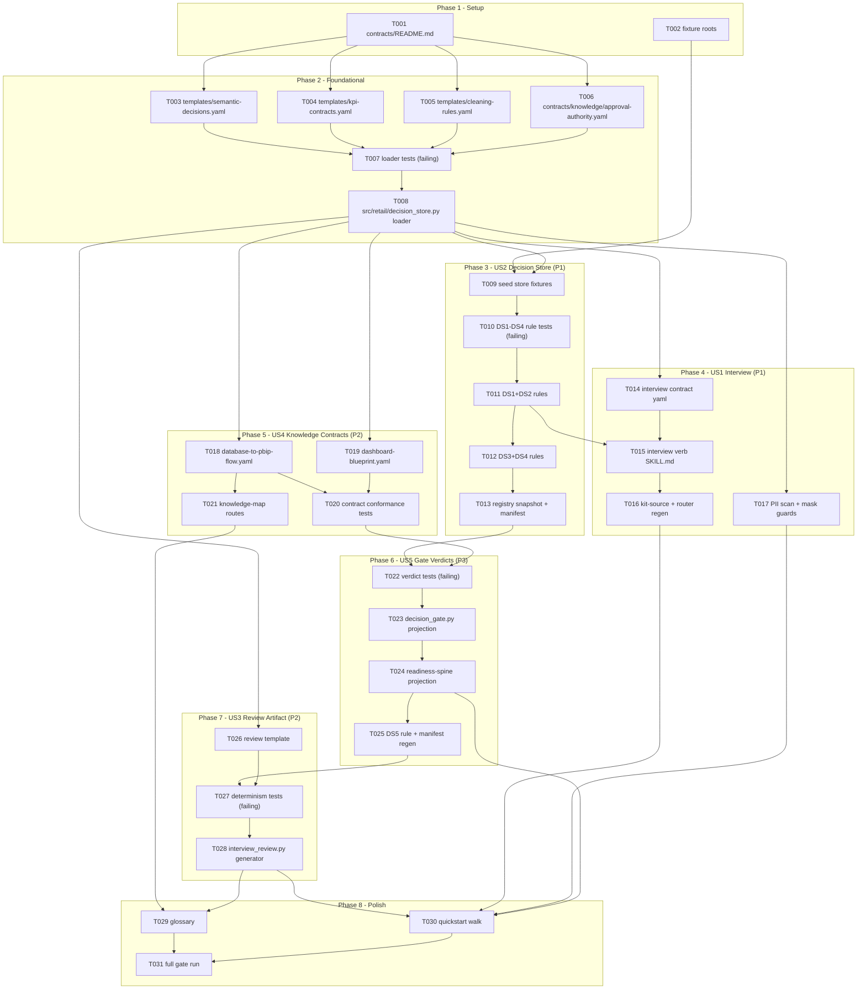

# Implementation Graph: Business Knowledge Interview, Decision Store, and Knowledge Contracts

**Feature**: `specs/121-business-knowledge-interview` | **Companion to**: [tasks.md](./tasks.md)

Task-level dependency DAG, serialized hotspots (same-file conflicts that forbid
parallelism), and safe parallel waves. Story colors: US2 decision store, US1
interview, US4 knowledge contracts, US5 gate verdicts, US3 review artifact.

## Task DAG

Edge rationale (non-obvious ones): `T011 -> T015` -- the interview verb instructs
approval recording, which must match the DS2 validity rules actually enforced;
`T013/T020 -> T022` -- verdict tests consume both the registered rule surface and the
per-stage blocking categories; `T025 -> T027` -- the review artifact embeds the gate
verdict (FR-025), so its tests need DS5-consistent verdict behavior.

## Serialized hotspots (same file -- never parallel)

| File | Tasks (in order) | Why serialized |
|---|---|---|
| `src/retail/rules/decision_store.py` | T011 -> T012 -> T025 | One rule module, three increments |
| `tests/unit/test_decision_store.py` | T007 -> T017 | Loader tests then mask-guard tests |
| `tests/unit/test_decision_store_rules.py` | T010 -> T025 | DS1-DS4 tests then DS5 extension |
| rule-registry snapshot + `docs/rules/rules-manifest.json` | T013 -> T025 | Manifest regenerated twice; second run must follow the first |
| `CLAUDE.md` router block + `.seshat/kit-source.yaml` | T016 only | Generated block -- single writer |
| `src/retail/decision_gate.py` | T023 -> T024 | Verdict core then spine projection |

## Parallel waves

| Wave | Tasks | Gate to enter |
|---|---|---|
| W0 | T001, T002 | -- |
| W1 | T003, T004, T005, T006 | W0 done |
| W2 | T007 | W1 done |
| W3 | T008 | T007 failing-red |
| W4 | T009, T014, T018, T019, T026 | T008 done (five files, four stories) |
| W5 | T010, T020 | T009 / T018+T019 done |
| W6 | T011 | T010 failing-red |
| W7 | T012, T017, T021 | T011 done (different files) |
| W8 | T013, T015 | T012 / T011+T014 done |
| W9 | T016, T022 | T015 / T013+T020 done |
| W10 | T023 | T022 failing-red |
| W11 | T024 | T023 done |
| W12 | T025 | T024 done |
| W13 | T027 | T025 + T026 done |
| W14 | T028 | T027 failing-red |
| W15 | T029, T030 | T028 (+T016/T017/T021/T024) done |
| W16 | T031 | everything else done |

Critical path (longest chain, 14 tasks):
`T001 -> T003 -> T007 -> T008 -> T009 -> T010 -> T011 -> T012 -> T013 -> T022 -> T023 -> T024 -> T025 -> T027 -> T028 -> T031`.
Widest safe fan-out is Wave 4 (five tasks). MVP exit (US2+US1 complete) is reached at
the end of Wave 9 (T016) without entering US5/US3 waves.
